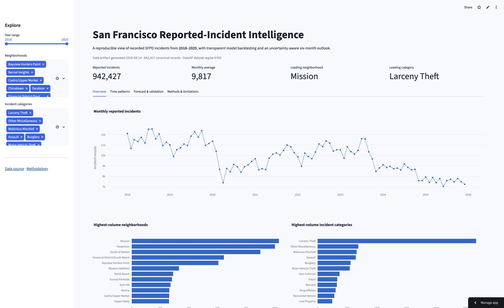
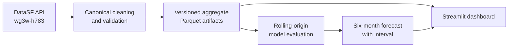
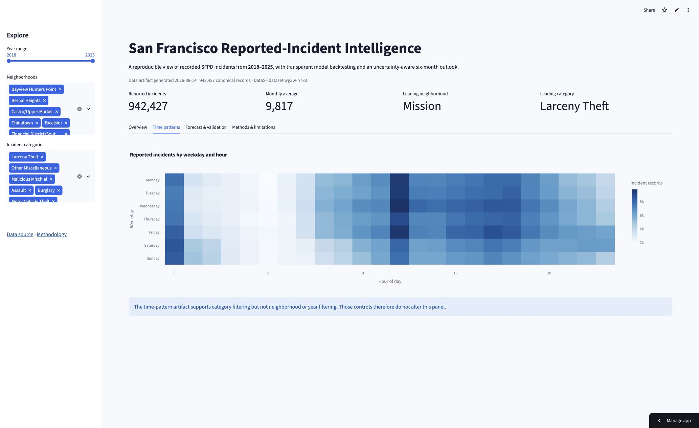
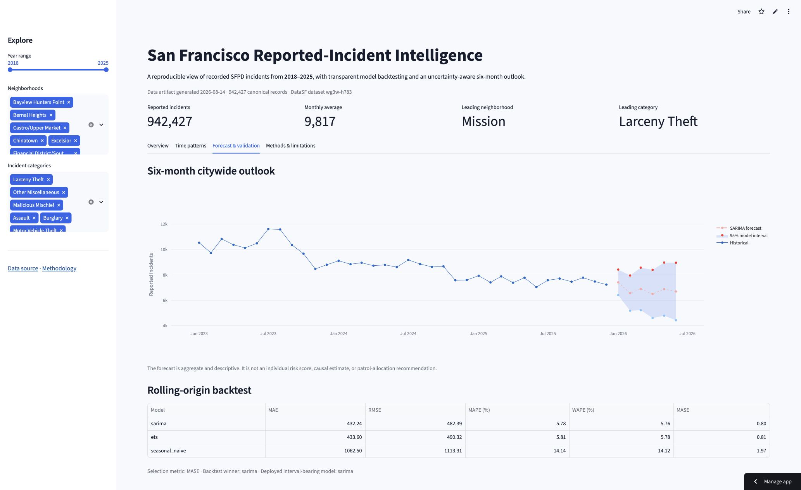

# San Francisco Reported-Incident Forecasting

[](https://github.com/sileshith/sf-incident-forecasting/actions/workflows/ci.yml)
[](https://www.python.org/)
[](LICENSE)
[](https://data.sfgov.org/d/wg3w-h783)
[](https://sf-incident-forecasting.streamlit.app/)

An end-to-end public-data project that transforms recorded San Francisco Police
Department incidents into reproducible aggregates, evaluates time-series models with
rolling-origin backtests, and presents an uncertainty-aware six-month forecast in an
interactive Streamlit dashboard.

**[Read the professional analytics report](reports/SF_Reported_Incident_Forecasting_Professional_Report.pdf)**
for the complete CRISP-DM methodology, exploratory findings, rolling-origin validation,
2026 outlook, engineering controls, monitoring plan, and responsible-use framework.

> This project measures **reported and recorded incidents**, not all crime or individual
> safety. Its forecasts are a statistical portfolio demonstration—not a causal model,
> risk score, or patrol-allocation recommendation.

[](https://sf-incident-forecasting.streamlit.app/)

*Explore the [live interactive dashboard](https://sf-incident-forecasting.streamlit.app/).*

## Why this project matters

Public-safety datasets are easy to visualize and easy to overstate. This project is
designed around the harder questions:

- Can another analyst rebuild the dashboard artifacts from the source?
- Does a forecast outperform credible simple baselines across multiple time periods?
- Are data scope, model uncertainty, and ethical limitations visible to the user?
- Can a large incident-level dataset become a fast, lightweight deployed product?

## What the system does



The pipeline downloads the complete 2018–2025 study window using deterministic
pagination, standardizes the incident schema, validates monthly continuity, creates
dashboard-ready aggregates, compares forecasting approaches, and records artifact
metadata and checksums.

## Analytical product

The dashboard provides:

- Monthly reported-incident trends with year, neighborhood, and category filters
- Neighborhood and category concentration views
- Hour-by-weekday patterns
- A six-month citywide forecast with a 95% model interval
- A transparent model-comparison table
- Data provenance, update metadata, and limitations in the interface
- Downloadable filtered aggregate data

The committed aggregates let the application start quickly without downloading nearly
one million records at runtime.

## Dashboard tour

### Executive overview

[](https://sf-incident-forecasting.streamlit.app/)

The overview turns 942,000+ reported incidents into a decision-ready summary: headline
metrics, long-run monthly movement, and the neighborhoods and categories contributing
the largest recorded volumes. All views respond to the dashboard filters.

### Temporal patterns

[](https://sf-incident-forecasting.streamlit.app/)

The weekday-by-hour heatmap exposes recurring reporting patterns that monthly totals
cannot show, while preserving the distinction between recorded activity and personal
risk.

### Forecast and validation

[](https://sf-incident-forecasting.streamlit.app/)

The forecast view pairs the six-month outlook and 95% model interval with rolling-origin
backtest results, keeping predictive performance and uncertainty visible beside the
projection.

### Verified result

Across six rolling forecast origins, SARIMA produced the lowest mean MASE (**0.80**),
narrowly ahead of ETS (**0.81**), with **5.78% mean MAPE** and **432 reported incidents
MAE**. ETS recorded **5.81% mean MAPE** and **434 MAE**; the seasonal-naive baseline
recorded **14.14% mean MAPE**, **1,063 MAE**, and **1.97 MASE** over the same folds.
These are historical backtest results rather than promised production accuracy.

## Professional report

The publication-ready
**[San Francisco Reported-Incident Forecasting Professional Report](reports/SF_Reported_Incident_Forecasting_Professional_Report.pdf)**
provides a concise, decision-oriented account of the project:

- Business and data understanding framed through CRISP-DM
- Data provenance, validation, and analytical scope
- Exploratory findings with explicit interpretation boundaries
- Comparative seasonal-naive, ETS, and SARIMA evaluation with fold-level consistency
- Six-month 2026 citywide forecast with model-based uncertainty
- Weekday-hour reporting-pattern heatmap with an interpretation guide
- Data-to-product provenance flow and engineering controls
- Limitations, monitoring protocol, and reproducibility commands

The report is the canonical narrative artifact for portfolio review. The notebook
retains the executable analysis and the model card records generated validation details.

## Forecast evaluation

Three interpretable forecasting approaches are evaluated:

1. Seasonal naive: the same month from the prior year
2. Additive Holt-Winters exponential smoothing
3. SARIMA(1,1,1)(1,1,1,12)

The evaluation uses an expanding-window rolling-origin design with multiple forecast
origins and a three-month horizon. MAE, RMSE, MAPE, WAPE, and MASE are reported. See the
[model card](docs/model_card.md) for generated results, intended use, and limitations.

This replaces reliance on a single favorable holdout period. Model performance is
treated as historical evidence, not a guarantee of future accuracy.

## Repository structure

```text
├── app.py                         # Canonical Streamlit application
├── assets/                        # README dashboard screenshots
├── pyproject.toml                 # Runtime and development environment
├── Makefile                       # Reproducible developer commands
├── src/sf_incidents/
│   ├── data.py                    # Local/DataSF ingestion and schema normalization
│   ├── artifacts.py               # Aggregate artifact construction and metadata
│   ├── forecasting.py             # Forecast model implementations
│   ├── evaluate.py                # Rolling-origin evaluation and model card
│   └── pipeline.py                # Pipeline command-line entry point
├── tests/                         # Data, aggregation, and forecasting tests
├── data/
│   ├── README.md                  # Provenance and rebuild instructions
│   └── processed/                 # Lightweight deployment artifacts
├── notebooks/                     # Original exploratory analysis retained for provenance
├── docs/
│   └── model_card.md              # Generated validation and limitations report
├── reports/
│   └── SF_Reported_Incident_Forecasting_Professional_Report.pdf
│                                    # Publication-ready CRISP-DM case-study report
└── .github/workflows/ci.yml       # Automated lint, tests, and compile checks
```

The publication notebook remains under `notebooks/` as executable analytical provenance.
Production logic lives in tested Python modules; the notebook is not required to build
or run the deployed product.

## Run locally

### Prerequisites

- Python 3.11
- [uv](https://docs.astral.sh/uv/)

```bash
git clone https://github.com/sileshith/sf-incident-forecasting.git
cd sf-incident-forecasting
uv sync --extra dev
uv run streamlit run app.py
```

The dashboard uses the committed aggregate artifacts, so no large download is required.

## Rebuild the project

From the DataSF API:

```bash
uv run sf-incidents-build
uv run sf-incidents-evaluate
```

From an existing incident CSV or Parquet export:

```bash
uv run sf-incidents-build --source path/to/incidents.csv
uv run sf-incidents-evaluate
```

Run quality checks:

```bash
uv run ruff check .
uv run pytest
```

Convenience aliases are also available through `make install`, `make build`, `make
evaluate`, `make check`, and `make app`.

## Data provenance

- **Publisher:** City and County of San Francisco
- **Dataset:** Police Department Incident Reports: 2018 to Present
- **DataSF identifier:** `wg3w-h783`
- **Study window:** January 2018 through December 2025
- **Spatial convention:** DataSF Analysis Neighborhoods
- **Unit of analysis:** Recorded incident reports

The incident-level dataset is excluded because of its size. `data/processed/metadata.json`
records source information, row count, creation time, and artifact hashes. Detailed
rebuild guidance is in [data/README.md](data/README.md).

## Limitations and responsible use

- Incident records reflect reporting, enforcement, and classification practices.
- Raw neighborhood totals are not population- or exposure-adjusted risk rates.
- The pandemic period represents a major structural break.
- The models exclude policy, economic, weather, event, and reporting-delay variables.
- Citywide projections do not imply neighborhood- or person-level risk.
- Forecast intervals are model-based and require ongoing calibration monitoring.

## Skills demonstrated

- Reproducible API ingestion and deterministic pagination
- Data schema normalization and validation
- Columnar aggregate design with Parquet
- Seasonal time-series forecasting and baseline design
- Rolling-origin backtesting and multi-metric evaluation
- Uncertainty communication and model documentation
- Interactive analytical product development with Streamlit and Plotly
- Automated testing, linting, packaging, and continuous integration

## Author and license

Built by **Sileshi Hirpa** as a portfolio case study in analytics engineering and
time-series forecasting.

Code is available under the [MIT License](LICENSE). Source data is provided by DataSF
under the terms published with the dataset.
